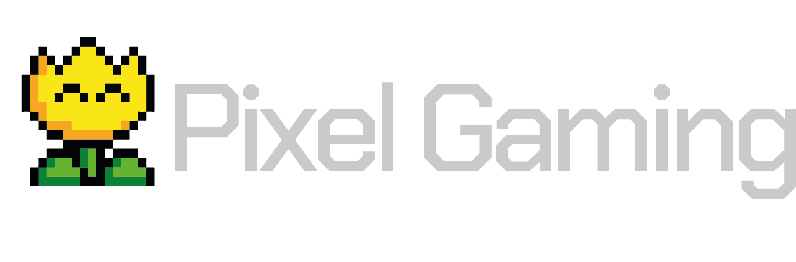
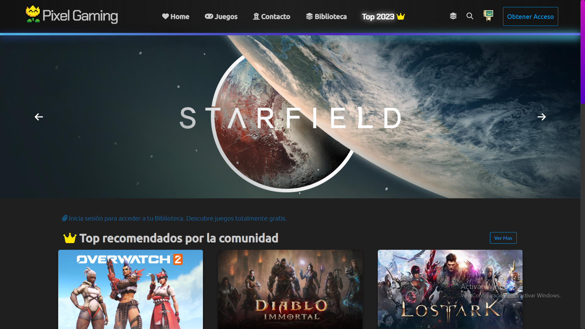
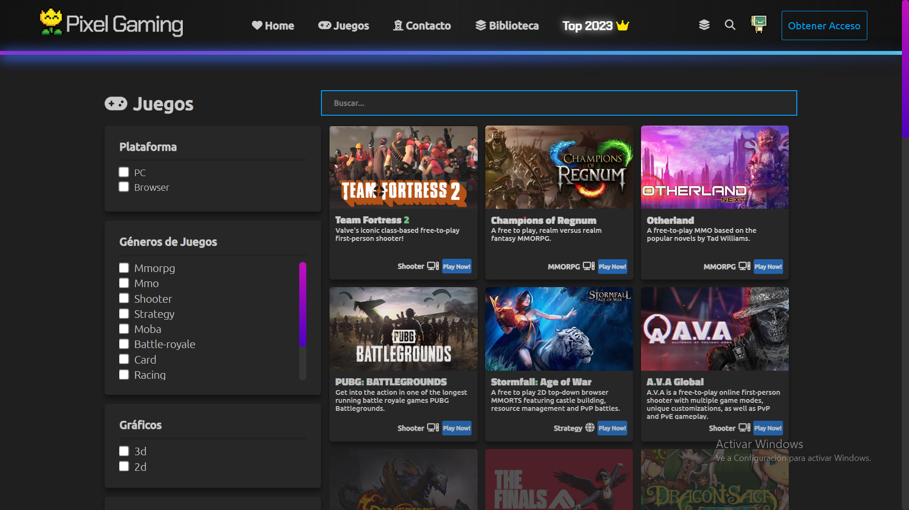

<h1 align="center">¡Hola! Soy Octavio Quintero 👋</h1>
<h1 align="center">Desarrollador FullStack </h1>

- 👨‍💻 Encuentra mis proyectos en mi [portafolio](https://octavioquintero.vercel.app/)

- 📫 Contacto: **octa.quinteroo@gmail.com**

<h3 align="left">Conéctate conmigo:</h3>
<p align="left">
  <a href="https://linkedin.com/in/octavio-quintero" target="blank">
    
  </a>
  <a href="https://instagram.com/octa.quintero" target="blank">
    
  </a>
</p>

<h2></h2>

PixelGaming es una plataforma innovadora para amantes de los juegos online, centrada en la búsqueda, personalización y interaccion de la comunidad. Descubre, crea tu biblioteca, y participa en la comunidad de jugadores.

- **Descubre y Explora:** Encuentra emocionantes juegos online.

- **Crea tu Cuenta:** Personaliza tu experiencia y comparte con la comunidad.

- **Biblioteca Personal:** Gestiona tus juegos favoritos fácilmente.

- **Top 2024:** Destacamos los mejores juegos del año.

- **Comunidad Activa:** Interactúa, comparte reseñas y descubre nuevas recomendaciones.

## Capturas

<h2></h2>


<h2></h2>


<h2></h2>

## Instalación

Para ejecutar el proyecto en tu entorno local, sigue estos sencillos pasos:

1. **Clonar el Repositorio:**
   ```bash
    git clone https://github.com/octa-quintero/pixelgaming

2. **Instalar Dependencias**

   ```bash

    Primero busca la raiz del proyecto

    Para la parte del servidor

    cd server
    npm install
    npm start

    Y para la parte del cliente

    cd client
    npm install
    npm start

## Estructura del Proyecto

El proyecto PixelGaming está organizado de la siguiente manera:

- **`client/`:** Contiene el código del frontend de la aplicación.

  - **`public/`:** Almacena archivos estáticos y de acceso público.

  - **`src/`:** Contiene el código fuente principal.

      - **`assets/`:** Contenido multimedia

      - **`components/`:** Componentes reutilizables de React

      - **`config/`:** Contiene configuraciones esenciales y componentes reutilizables relacionados con la lógica de configuración de la aplicación.

      - **`redux/`:** Contiene archivos relacionados con la implementación de Redux para gestionar el estado global de la aplicación.

          - **`actions/`:** Almacena archivos que definen las acciones de Redux, que son eventos que desencadenan cambios en el estado.

          - **`reducers/`:** Contiene archivos que definen los reducers de Redux. Los reducers especifican cómo cambia el estado en respuesta a las acciones enviadas.

         - **`store.js`:** Archivo principal que crea y exporta la tienda Redux. La tienda es un objeto central que mantiene el estado global de la aplicación.

  - **`App.js`:** Punto de entrada principal del frontend.

  - **`index.js`:** Punto de entrada para renderizar la aplicación.

  - **`package.json`:** Gestiona dependencias y scripts del frontend.

  - **`webpack.config.js`:** Contiene la configuración principal de Webpack para empaquetar y construir tu aplicación.

  - **`setupProxy.js`:** Contiene la configuración del servidor proxy para redirigir solicitudes durante el desarrollo.


- **`server/`:** Contiene el código del backend de la aplicación.

  - **`src/`:** Contiene el código fuente principal.

      - **`controllers/`:** Contiene controladores que manejan la lógica de las llamadas a la api.

      - **`middleware/`:** Contiene archivos relacionados con la implementación de middleware en tu aplicación.

      - **`models/`:** Almacena modelos de datos o esquemas de la base de datos.

      - **`routes/`:** Define las rutas de la API.

  - **`app.js`:** Archivo principal de configuración de la aplicación, que incluye la habilitación de CORS y el manejo de middleware para errores.

  - **`db.js`:** Archivo dedicado para la configuración de Sequelize, definición de modelos y sus relaciones en la base de datos.

- **`index.js`:** Archivo principal que inicia el servidor Express, configura middleware, maneja archivos estáticos y sincroniza la base de datos.

- **`package.json`:** Gestiona dependencias y scripts del backend...


## API y Endpoints:

Para obtener información sobre juegos gratuitos, esta aplicación utiliza la API proporcionada por FreeToGame. La API ofrece datos sobre diversos juegos gratuitos disponibles en su plataforma.

Para obtener la lista completa de juegos, puedes realizar una solicitud GET al endpoint base

https://www.freetogame.com/api/games

Esto devolverá un conjunto de datos JSON con información detallada sobre varios juegos gratuitos, incluyendo detalles como nombre, género, plataforma y más.

Persistencia de Datos en el Backend

Para mejorar la eficiencia y la capacidad de filtrado, la aplicación almacena los datos obtenidos de la API de FreeToGame en una base de datos en el backend. Este enfoque permite utilizar controladores y filtros personalizados para acceder y manipular la información de manera más efectiva...

## Manejo del Estado y Componentes (Frontend):

Implemente la gestión de estados utilizando Redux. La estructura de archivos y carpetas sigue un patrón organizativo común para facilitar la comprensión y el mantenimiento del código.

## Autenticación y Autorización:

El middleware adminAuthorization en la gestión de cuentas es una capa crítica de seguridad diseñada para restringir el acceso a funcionalidades específicas relacionadas con la administración de cuentas, reservando estas acciones solo para usuarios con el rol de administrador.

En caso de que el usuario no sea un administrador, el middleware puede redirigir a una página de inicio o devolver una respuesta de error. Esto garantiza que solo los administradores tengan acceso a rutas o funciones específicas. (tokenAuthorization):

El middleware tokenAuthorization se encarga de verificar la validez del token de autenticación de un usuario y, en caso de ser válido, proporciona acceso a ciertas rutas.

El middleware Verificación de Token:
Comprueba si el tokenAuthorization es válido y está firmado correctamente. Esto garantiza que la solicitud provenga de un usuario autenticado y que la sesión sea válida.

Almacenamiento de Datos de Usuario:
Si el token es válido, el middleware puede decodificar la información del usuario y almacenarla en el objeto de solicitud (req). Esto facilita el acceso a datos del usuario en las rutas subsiguientes sin necesidad de volver a autenticarse en cada solicitud.

Gestión de Sesión:
El middleware contribuye a la gestión de sesiones al validar la autenticidad del token. Permite que los usuarios permanezcan autenticados entre múltiples solicitudes sin la necesidad de ingresar credenciales en cada interacción.

## Base de Datos y Modelos (Backend):

En la arquitectura del backend, la base de datos se ha diseñado con tres partes fundamentales: games-models, review-models, y users-models. Cada parte cumple un rol específico en la gestión y almacenamiento de datos, contribuyendo a la funcionalidad completa de la aplicación. A continuación, se explica la función de cada parte de la base de datos:


<h2><b>games-models</b></h2>

En esta sección, se gestionan los datos relacionados con los juegos obtenidos desde la API de FreeToGame.

<b>Obtención de Datos desde la API</b>

Se realizan solicitudes a la API de FreeToGame para obtener información sobre juegos gratuitos. Los datos recuperados incluyen detalles como nombre, género, plataforma, y más.

<b>Almacenamiento en el Modelo de Juegos</b>

Utilizando el modelo de games-models, los datos de los juegos se almacenan en la base de datos. Cada entrada en este modelo representa un juego individual con su información asociada.

<b>Acceso desde el Frontend</b>

Los datos almacenados en el modelo de juegos se utilizan para alimentar el frontend, permitiendo a los usuarios explorar y descubrir juegos disponibles en la plataforma.

<h2><b>review-models</b></h2>

En esta sección, se gestionan las revisiones y comentarios que los usuarios pueden dejar en los juegos.

<b>Asociación con Usuarios y Juegos</b>

Cada revisión se asocia a un usuario específico y al juego correspondiente. Esto permite rastrear quién dejó la revisión y a qué juego se refiere.

<b>Almacenamiento en el Modelo de Revisiones</b>

Utilizando el modelo de review-models, las revisiones se almacenan en la base de datos. Cada revisión contiene el texto del comentario, la puntuación asignada y la referencia al usuario y juego asociados.

<b>Visualización en el Frontend</b>

Las revisiones almacenadas se pueden mostrar en el frontend, permitiendo a los usuarios leer las opiniones de otros jugadores sobre un juego en particular.

<h2><b>users-models</b></h2>

En esta sección, se gestionan los datos de los usuarios, incluyendo la creación de nuevas cuentas.

<b>Registro de Nuevos Usuarios</b>

Cuando un usuario desea crearse una cuenta, los detalles proporcionados durante el registro se almacenan en el modelo de users-models.

<b>Autenticación y Acceso Protegido</b>

La información del usuario, incluyendo credenciales y roles, se utiliza para la autenticación. Las rutas y funciones protegidas se aseguran de que solo usuarios autenticados tengan acceso.

<b>Gestión de Sesiones y Roles</b>

El modelo de usuarios permite gestionar sesiones y roles, asegurando que las acciones administrativas estén reservadas para usuarios con privilegios adecuados.


### Próximos Pasos:

PixelGaming está en constante desarrollo, y hay muchas maneras de contribuir y mejorar la plataforma. Algunas áreas que estamos considerando para futuras mejoras incluyen:

- Implementación de nuevas características.
- Mejoras en la interfaz de usuario.
- Optimizaciones de rendimiento.
- Añadir soporte para más API de juegos.

### Cómo Contribuir:

1. Fork el repositorio.
2. Crea una rama (`git checkout -b feature/nueva-funcionalidad`).
3. Realiza cambios y haz commits (`git commit -am 'Añadir nueva funcionalidad'`).
4. Haz push a la rama (`git push origin feature/nueva-funcionalidad`).
5. [Abre un pull request](https://github.com/tuusuario/pixelgaming/pulls) con una descripción detallada de los cambios.

## ¿Necesitas Ayuda?

¡Gracias por explorar PixelGaming! Esperamos que encuentres la plataforma útil y emocionante. Si tienes alguna pregunta, problema o sugerencia, no dudes en contactarte conmigo **octa.quinteroo@gmail.com**.